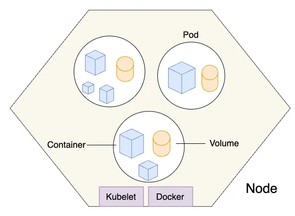

# Introducing Pods in Kubernetes: The Smallest Deployable Unit

Kubernetes is a powerful system for managing containerized applications, and at the heart of it all lies the concept of the **Pod**. If you're just getting started with Kubernetes, understanding what a Pod is—and what it isn't—is an essential first step. This guide will walk you through the fundamentals of Pods, their architecture, lifecycle, and best practices to help you confidently work with Kubernetes.

---

## What is a Pod?

In Kubernetes, a **Pod** is the smallest and simplest unit you can deploy. It represents a single instance of a running process in your cluster. A Pod can contain:

- A **single container** (the most common case, e.g., running a web server like Nginx)
- **Multiple containers** that are tightly coupled and need to share resources, such as a main application and a logging sidecar

Think of a Pod as a wrapper around one or more containers that need to work closely together. These containers share the same:

- **Network namespace** (they share the same IP address and port space, allowing communication via `localhost`)
- **Storage volumes** (for shared data access, such as configuration files or logs)
- **PID namespace** (optionally, for process isolation, though this is less commonly customized)

Pods are designed to run a single instance of an application process, making them lightweight and focused compared to traditional virtual machines.

---

## Why Do Pods Exist?

You might wonder, why not just deploy containers directly? Kubernetes manages Pods rather than individual containers to support more complex use cases, like running sidecar containers (e.g., for logging or monitoring) that need to be tightly integrated with the main application container. Pods provide a unified environment for containers that must operate as a single unit.

**Benefits of Pods:**

- Co-located processes can communicate over `localhost`, reducing latency and simplifying networking
- Shared storage volumes allow containers to access common data, such as configuration or temporary files
- Simplifies coordination and lifecycle management by treating multiple containers as a single entity
- Enables patterns like sidecars (e.g., a logging agent) or adapters (e.g., a proxy for external services)

For example, a Pod might include a web application container and a sidecar container that collects and forwards logs to a centralized system, both sharing the same network and storage context.

---

## Pod Architecture

Each Pod includes:

- **One or more containers**, each running a specific image (e.g., `nginx`, `redis`)
- **Optional volumes** for data persistence or sharing between containers (e.g., `emptyDir` for temporary storage or `persistentVolumeClaim` for durable storage)
- A shared **network interface**, meaning all containers in the Pod share a single IP address and can communicate over `localhost`

For example, you might have an app container and a log collector container in the same Pod, structured like this:

```
[Pod]
 |-- Container A (App, e.g., Node.js app)
 |-- Container B (Sidecar, e.g., Fluentd for logging)
 |-- Shared Network (single IP, localhost communication)
 |-- Shared Volumes (e.g., emptyDir for log files)
```

This architecture ensures tight integration while keeping the Pod lightweight and focused on a specific task. The following diagram illustrates how pods are scheduled on a Kubernetes node. A node is the smallest compute unit in Kubernetes, equipped with a kubelet to manage pod scheduling and a container runtime (such as Docker) to run containers. Each pod, which is the basic deployable unit in Kubernetes, can contain one or more containers that share the same network namespace and storage volumes.


---

## When to Use Multiple Containers in a Pod

A common question is when to use multiple containers in a single Pod versus separate Pods. Multiple containers in a Pod are appropriate when:

- Containers are **tightly coupled** and need to share resources (e.g., a web server and a reverse proxy like Envoy)
- Containers need to communicate efficiently over `localhost` (e.g., an app and a metrics exporter like Prometheus)
- Containers share the same lifecycle (e.g., they should start, stop, and scale together)

**Examples of multi-container Pods:**

- **Sidecar pattern**: A logging agent (e.g., Fluentd) collects logs from the main app’s filesystem
- **Adapter pattern**: A proxy container modifies requests or responses for the main app
- **Ambassador pattern**: A container handles external communication, like connecting to a database

However, if containers serve distinct purposes (e.g., a web server and a database), they should run in separate Pods for better isolation and scalability.

---

## Creating a Pod

You can define a Pod using a YAML file, which Kubernetes uses to create and manage the Pod. Here’s a simple example with a single container running an Nginx web server:

```yaml
apiVersion: v1
kind: Pod
metadata:
  name: my-app-pod
  labels:
    app: my-app
spec:
  containers:
  - name: my-app
    image: nginx:latest
    ports:
    - containerPort: 80
```

This YAML defines a Pod named `my-app-pod` with one container running the `nginx` image, exposing port 80, and specifying resource limits and requests to ensure proper resource allocation.

Apply it with:

```bash
kubectl apply -f my-app-pod.yaml
```

You can verify the Pod’s status with:

```bash
kubectl get pods
```

This creates a standalone Pod, but in production, you’ll typically use controllers like **Deployments** to manage Pods for scalability and reliability.

---

## Pod Lifecycle

Pods have a lifecycle that includes the following phases:

- **Pending**: The Pod is created but not yet running (e.g., waiting for scheduling, image pulling, or resource availability)
- **Running**: At least one container is actively running on a node
- **Succeeded**: All containers have terminated successfully (exit code 0), typically for one-off tasks
- **Failed**: At least one container terminated with a non-zero exit code
- **Unknown**: Kubernetes cannot determine the Pod’s state (e.g., due to node failure)

Importantly, Pods are **ephemeral**. If a Pod dies (e.g., due to a crash or node failure), it won’t be automatically recreated unless managed by a higher-level resource like a **Deployment**, **StatefulSet**, or **Job**. This ephemeral nature makes standalone Pods unsuitable for production workloads without a controller.

---

## Common `kubectl` Commands

Here are some useful commands for working with Pods:

```bash
kubectl get pods # List all Pods in the current namespace
kubectl describe pod <pod-name> # View detailed Pod information
kubectl logs <pod-name> # View logs for a specific container
kubectl logs <pod-name> -c <container-name> # View logs for a specific container in a multi-container Pod
kubectl exec -it <pod-name> -- /bin/sh # Open an interactive shell in the Pod
kubectl delete pod <pod-name> # Delete a specific Pod
```

For multi-container Pods, specify the container name with `-c` for commands like `logs` or `exec`.

---

## Best Practices

To use Pods effectively in Kubernetes:

- Use **Deployments** or other controllers (e.g., StatefulSets, DaemonSets) instead of standalone Pods in production to ensure automatic restarts and scaling
- Keep Pods to a **single main container** when possible to simplify management and debugging
- Use **initContainers** for setup tasks (e.g., database migrations) and **sidecars** for supporting tasks (e.g., logging or monitoring)
- Don’t store state in Pods—use **PersistentVolumes** or external storage for data persistence
- Define **resource requests and limits** in the Pod spec to prevent resource contention and ensure cluster stability
- Use **labels** in the `metadata` section to organize and select Pods for services or scaling

Following these practices ensures your Pods are robust and fit well into Kubernetes’ ecosystem.

---

## Common Pitfalls

New users often encounter these mistakes when working with Pods:

- **Running standalone Pods in production**: Without a controller like a Deployment, Pods won’t recover from failures, leading to downtime
- **Overloading Pods with too many containers**: This can complicate debugging and resource management; prefer separate Pods for loosely coupled components
- **Ignoring resource limits**: Unbounded resource usage can destabilize the cluster; always set CPU and memory limits
- **Using Pods for stateful applications without proper storage**: Ephemeral Pods lose data on restart; use PersistentVolumes for stateful workloads
- **Not monitoring Pod health**: Use **liveness** and **readiness probes** to ensure containers are healthy and ready to serve traffic

Avoiding these pitfalls will help you build more reliable Kubernetes applications.

---

## Troubleshooting Pods

Pod not behaving as expected? Common issues include crashes, scheduling failures, or misconfigurations. Try these steps:

- `kubectl describe pod <pod-name>` to see events and reasons (e.g., why a Pod is stuck in `Pending`)
- `kubectl logs <pod-name>` to inspect container output for errors
- `kubectl exec -it <pod-name> -- /bin/sh` to debug inside the container

Common statuses include:

- `CrashLoopBackOff`: The container is repeatedly crashing, often due to misconfiguration or application errors. Check logs for details
- `ImagePullBackOff`: Kubernetes couldn’t pull the container image (e.g., wrong image name or registry access issues)
- `Pending`: The Pod is waiting for scheduling, possibly due to insufficient resources or node affinity rules
- `ErrImageNeverPull`: The image pull policy is set to `Never`, but the image isn’t available locally

For multi-container Pods, specify the container name (e.g., `kubectl logs <pod-name> -c <container-name>`) to isolate issues.

---

## Conclusion

Pods are fundamental to working with Kubernetes. They represent the building block upon which everything else—Deployments, ReplicaSets, Services—is built. Understanding Pods, their lifecycle, and their architecture helps you harness the power and flexibility Kubernetes provides. By following best practices and avoiding common pitfalls, you can create robust and scalable applications.

Ready to try it yourself? Create a simple Pod using the example YAML, explore its lifecycle with `kubectl` commands, and then move on to higher-level constructs like Deployments to manage Pods effectively.

For further reading, check out the [official Kubernetes documentation on Pods](https://kubernetes.io/docs/concepts/workloads/pods/).