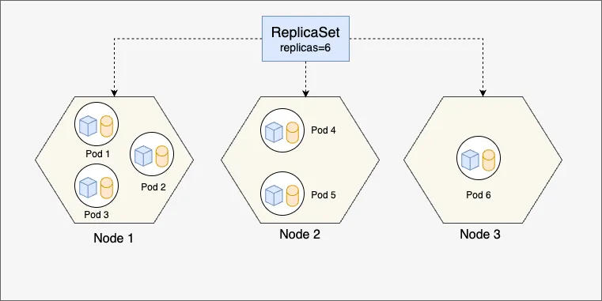

# Introducing Pods in Kubernetes - III: Pod Management with ReplicaSet

> 💬 *“成功而弗居也。夫唯弗居，是以弗去。(Accomplishes yet does not dwell on it. Because he does not dwell on it, It never leaves him.)"*  
> — Laozi

In my [previous post](https://wang-engineer.github.io/blogger/posts/2025-06-24-pod-2-yaml/), we explored how to define and configure Kubernetes Pods using YAML manifests. While Pods are the fundamental units in Kubernetes, managing them individually can become challenging, especially when you need multiple instances of the same Pod for scalability or reliability. This is where **ReplicaSets** come into play.

In this third post of our Kubernetes Pod series, we’ll dive into ReplicaSets, focusing on why they are essential and the advantages they offer. We’ll also examine a sample ReplicaSet YAML manifest, highlighting the ReplicaSet-specific components.

## Why Use ReplicaSets?

A ReplicaSet is a Kubernetes controller that ensures a specified number of Pod replicas are running at all times. It’s designed to maintain a stable set of Pods, automatically replacing any that fail or are terminated. Here’s why ReplicaSets are critical in Kubernetes:

1. **High Availability**: By running multiple Pod replicas, ReplicaSets ensure your application remains available even if some Pods fail due to crashes, node failures, or other issues. Kubernetes automatically restarts or reschedules failed Pods to maintain the desired replica count.
2. **Scalability**: ReplicaSets allow you to scale your application by specifying the desired number of replicas. This makes it easy to handle increased traffic or workload demands.
3. **Self-Healing**: If a Pod is deleted or crashes, the ReplicaSet detects the discrepancy and creates a new Pod to match the desired state. This self-healing mechanism reduces manual intervention.
4. **Simplified Management**: Instead of managing individual Pods, you define a single ReplicaSet that handles the creation, deletion, and monitoring of multiple Pods based on a template.



The diagram above illustrates how a Kubernetes ReplicaSet ensures the desired number of Pods are always running across a cluster. In this example, the ReplicaSet is configured with 6 replicas. These Pods are distributed across three nodes (Node 1, Node 2, and Node 3), allowing Kubernetes to balance the workload. Each Pod contains one or more containers that host application components. The ReplicaSet continuously monitors the state of the cluster and takes action if any of the Pods fail—due to crashes, node failures, or other disruptions. If a Pod stops running, Kubernetes automatically reschedules it on a healthy node to restore the defined state. For instance, if Node 2 goes offline, the ReplicaSet will detect the loss of Pods 4 and 5 and recreate them on another available node, such as Node 3. This self-healing capability ensures high availability and fault tolerance. This mechanism highlights the declarative nature of Kubernetes—where you define the desired state, and the system actively works to maintain it.

While ReplicaSets are powerful, they are often used indirectly through higher-level controllers like Deployments, which we’ll cover in future posts. However, understanding ReplicaSets is key to grasping how Kubernetes achieves resilience and scalability.

## ReplicaSet YAML Manifest

Let’s look at a sample ReplicaSet YAML manifest. The structure is similar to a Pod manifest, but with additional fields specific to ReplicaSet functionality. Below is an example that creates three replicas of an Nginx web server Pod.

```yaml
apiVersion: apps/v1
kind: ReplicaSet
metadata:
  name: nginx-replicaset
  labels:
    app: nginx
spec:
  replicas: 3
  selector:
    matchLabels:
      app: nginx
  template:
    metadata:
      labels:
        app: nginx
    spec:
      containers:
      - name: nginx
        image: nginx:latest
        ports:
        - containerPort: 80
```

### Key Components of the ReplicaSet YAML

Since this post focuses on ReplicaSet-specific parts, I’ll briefly cover the familiar fields and dive deeper into the unique ones. For a detailed explanation of Pod-related fields (e.g., `containers`, `image`), refer to my [previous post](https://wang-engineer.github.io/blogger/posts/2025-06-24-pod-2-yaml.md/).

- **`apiVersion: apps/v1`**: Specifies the Kubernetes API version for ReplicaSets, which is part of the `apps` API group.
- **`kind: ReplicaSet`**: Indicates that this is a ReplicaSet resource.
- **`metadata`**: Contains the name (`nginx-replicaset`) and labels (`app: nginx`) for identifying the ReplicaSet.
- **`spec`**: Defines the desired state of the ReplicaSet, including:
  - **`replicas: 3`**: Specifies the desired number of Pod replicas. Kubernetes ensures exactly three Pods are running at all times.
  - **`selector`**: Defines how the ReplicaSet identifies the Pods it manages. The `matchLabels` field ensures the ReplicaSet controls Pods with the label `app: nginx`. This is critical for associating Pods with the ReplicaSet.
  - **`template`**: Contains the Pod template, which is nearly identical to a standalone Pod spec. It defines the Pods that the ReplicaSet will create, including their labels and container configurations.

### ReplicaSet-Specific Fields Explained

The `replicas` and `selector` fields are the heart of the ReplicaSet’s functionality:

- **`replicas`**: This field allows you to scale your application by setting the number of Pods. For example, increasing `replicas` to 5 would prompt Kubernetes to create two additional Pods. Decreasing it to 1 would terminate two Pods.
- **`selector`**: The `matchLabels` selector ensures the ReplicaSet only manages Pods with matching labels. This decoupling of Pod selection from creation allows ReplicaSets to adopt existing Pods that match the selector, enhancing flexibility.

The `template` field is essentially a Pod definition embedded within the ReplicaSet. The ReplicaSet uses this template to create new Pods when needed, ensuring consistency across all replicas.

## Advantages of ReplicaSets

Using ReplicaSets offers several advantages over managing Pods manually:

- **Automated Scaling**: Adjusting the `replicas` field allows you to scale up or down with a single change to the manifest, and Kubernetes handles the rest.
- **Resilience**: ReplicaSets continuously monitor the cluster state and replace failed Pods, ensuring your application remains operational.
- **Consistency**: The Pod template ensures all replicas are identical, reducing configuration drift.
- **Label-Based Management**: The `selector` allows ReplicaSets to manage Pods dynamically based on labels, making it easier to organize and control resources.

## Applying and Managing the ReplicaSet

To apply the ReplicaSet, save the YAML above as `nginx-replicaset.yaml` and run:

```bash
kubectl apply -f nginx-replicaset.yaml
```

Verify the ReplicaSet and its Pods:

```bash
kubectl get replicaset
kubectl get pods
```

You should see the `nginx-replicaset` with three running Pods, each labeled `app: nginx`.

To view detailed information about the ReplicaSet:

```bash
kubectl describe replicaset nginx-replicaset
```

To scale the ReplicaSet to, for example, 4 Pods:

```bash
kubectl scale replicaset nginx-replicaset --replicas=4
```

To delete the ReplicaSet and its associated Pods:

```bash
kubectl delete replicaset nginx-replicaset
```

## Conclusion

ReplicaSets are a cornerstone of Kubernetes’ ability to manage containerized applications at scale. By ensuring a specified number of Pod replicas are always running, they provide high availability, scalability, and self-healing capabilities. While ReplicaSets are often managed through Deployments in production, understanding their role and configuration is essential for mastering Kubernetes. In the next post, we’ll explore [Deployments](https://wang-engineer.github.io/blogger/posts/2025-06-07-deployment-yaml/), which build on ReplicaSets to provide rolling updates and rollback capabilities. 

For a more detailed guide, check out the [official Kubernetes ReplicaSet tutorial](https://kubernetes.io/docs/concepts/workloads/controllers/replicaset/). 