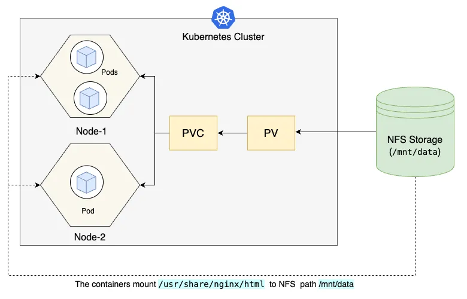

# Understanding Persistent Volumes in Kubernetes: Part 1 - Stateful Persistent Volumes

> 💬 *“大直若屈, 大巧若拙, 大辩若讷。(Great straightness appears bent; Great skill appears clumsy; Great eloquence appears hesitant)"*  
> — Laozi

This tutorial is the first part of a series aimed at demystifying Persistent Volumes (PVs) in Kubernetes, focusing on stateful storage concepts. In this post, we'll explore what Persistent Volumes are, why they matter, and how they work with Persistent Volume Claims (PVCs) and Pods. We'll provide practical YAML examples and dive into implementation, troubleshooting, and common pitfalls. Part 2 will cover dynamic provisioning of PVs.

## 1. Introduction to Persistent Volumes

A **Persistent Volume (PV)** in Kubernetes is a cluster-wide resource that represents a piece of storage in your cluster. Unlike ephemeral storage (e.g., container storage that disappears when a Pod is terminated), PVs provide a way to manage durable storage that persists beyond the lifecycle of a Pod. They are essential for stateful applications like databases, file servers, or any workload requiring data retention.

### Why Use Persistent Volumes?
- **Data Persistence**: PVs ensure data remains available even if a Pod is deleted or rescheduled.
- **Decoupling Storage**: PVs abstract the underlying storage details, allowing developers to focus on application logic rather than storage management.
- **Portability**: PVs enable applications to work across different storage backends (e.g., NFS, cloud storage like AWS EBS, or local disks).
- **Resource Management**: PVs allow administrators to pre-provision storage with specific access policies and capacities.

### Benefits of Persistent Volumes
- **Reliability**: Data is preserved across Pod restarts or failures.
- **Flexibility**: Supports various storage types (e.g., NFS, iSCSI, cloud-based storage).
- **Reusability**: PVs can be reused by multiple Pods via Persistent Volume Claims (PVCs).

### Relationship Between PV, PVC, and Pods
A **Persistent Volume (PV)** is a cluster resource that defines the storage details (e.g., capacity, access mode, and storage type). A **Persistent Volume Claim (PVC)** is a request for storage by a user or application, specifying requirements like size and access mode. The PVC binds to a matching PV. A **Pod** then uses the PVC to mount the PV's storage as a volume, making it accessible to containers. This abstraction separates storage provisioning (PV) from storage consumption (PVC/Pod).

In this tutorial, we'll walk through creating a PV, binding it with a PVC, and using it in a Pod, followed by implementation and troubleshooting steps.

## 2. Sample Persistent Volume (PV) YAML

Below is an example of a Persistent Volume YAML configuration using an NFS-backed storage.

```yaml
apiVersion: v1
kind: PersistentVolume
metadata:
  name: my-pv
  labels:
    type: nfs
spec:
  capacity:
    storage: 1Gi
  accessModes:
    - ReadWriteMany
  persistentVolumeReclaimPolicy: Retain
  storageClassName: manual
  nfs:
    path: /mnt/data
    server: 192.168.1.100
```

### Explanation of PV YAML
- **apiVersion and kind**: Specifies the Kubernetes API version (`v1`) and resource type (`PersistentVolume`).
- **metadata.name**: A unique name for the PV (`my-pv`).
- **metadata.labels**: Optional labels for organization or filtering (e.g., `type: nfs`).
- **spec.capacity.storage**: Defines the storage size (e.g., `1Gi` for 1 gibibyte).
- **spec.accessModes**: Specifies how the volume can be accessed:
  - `ReadWriteMany` (RWX): Multiple Pods can read and write.
  - Other modes include `ReadWriteOnce` (RWO) and `ReadOnlyMany` (ROX).
- **spec.persistentVolumeReclaimPolicy**: Defines what happens to the PV when released:
  - `Retain`: Keeps the PV and data intact after PVC deletion.
  - Other options: `Delete` or `Recycle`.
- **spec.storageClassName**: Identifies the storage class; `manual` indicates manual provisioning.
- **spec.nfs**: Specifies NFS details (replace `path` and `server` with your NFS server details).

This PV defines a 1Gi NFS-backed volume that multiple Pods can read and write to.

## 3. Sample Persistent Volume Claim (PVC) YAML

The PVC requests storage from a PV that matches its requirements.

```yaml
apiVersion: v1
kind: PersistentVolumeClaim
metadata:
  name: my-pvc
spec:
  accessModes:
    - ReadWriteMany
  resources:
    requests:
      storage: 1Gi
  storageClassName: manual
  selector:
    matchLabels:
      type: nfs
```

### Explanation of PVC YAML
- **apiVersion and kind**: Specifies the Kubernetes API version (`v1`) and resource type (`PersistentVolumeClaim`).
- **metadata.name**: A unique name for the PVC (`my-pvc`).
- **spec.accessModes**: Must match the PV's access mode (`ReadWriteMany`).
- **spec.resources.requests.storage**: Requests 1Gi of storage, matching or less than the PV's capacity.
- **spec.storageClassName**: Must match the PV's `storageClassName` (`manual`).
- **spec.selector.matchLabels**: Ensures the PVC binds to a PV with matching labels (e.g., `type: nfs`).

The PVC searches for a PV with matching `accessModes`, `storageClassName`, and labels, then binds to it (in this case, `my-pv`).

## 4. Sample Pod YAML Using the PVC

A Pod uses the PVC to mount the PV's storage.

```yaml
apiVersion: v1
kind: Pod
metadata:
  name: my-pod
spec:
  containers:
  - name: my-container
    image: nginx
    volumeMounts:
    - mountPath: /usr/share/nginx/html
      name: my-volume
  volumes:
  - name: my-volume
    persistentVolumeClaim:
      claimName: my-pvc
```

### Explanation of Pod YAML
- **apiVersion and kind**: Specifies the Kubernetes API version (`v1`) and resource type (`Pod`).
- **metadata.name**: A unique name for the Pod (`my-pod`).
- **spec.containers**: Defines the container(s) in the Pod (here, an `nginx` container).
- **spec.containers.volumeMounts**: Mounts the volume inside the container:
  - `mountPath`: The path inside the container where the volume is mounted (`/usr/share/nginx/html`).
  - `name`: References the volume defined in `spec.volumes` (`my-volume`).
- **spec.volumes**: Defines the volume:
  - `name`: A name for the volume (`my-volume`).
  - `persistentVolumeClaim.claimName`: Links to the PVC (`my-pvc`).

This Pod mounts the storage from `my-pvc` (bound to `my-pv`) into the Nginx container's web directory.

## 5. How PV, PVC, and Pod Work Together

Here's a step-by-step explanation of how a Pod uses a PV:
**PV Creation**: A cluster administrator creates a PV (`my-pv`) that defines storage (e.g., 1Gi on an NFS server).
**PVC Creation**: A user or application creates a PVC (`my-pvc`) to request storage with specific requirements (e.g., size, access mode, storage class). 
**PVC Binding**: The PVC (`my-pvc`) requests storage and binds to a matching PV (`my-pv`) based on access mode, storage class, and labels.
**Pod Usage**: The Pod (`my-pod`) references the PVC (`my-pvc`) in its `volumes` section, mounting the PV's storage into the container's filesystem. Since the `accessMode` is set to `readWriteMany` in our case, you can see in the diagram below that multiple pods in different nodes can mount the NFS storage simultaneously.
**Data Access**: The container reads/writes data to the mounted path (`/usr/share/nginx/html`), which persists on the PV's underlying storage.



This process ensures that the Pod's data is stored durably, even if the Pod is deleted or rescheduled.

## 6. Concept Clarifications, Misconceptions, and Pitfalls

### Common Misconceptions
- **PV is the Storage Itself**: A PV is a Kubernetes abstraction, not the physical storage. It references underlying storage (e.g., NFS, EBS).
- **PVCs Create PVs**: PVCs only request and bind to existing PVs (unless dynamic provisioning is used, covered in Part 2).
- **All PVs are Permanent**: The `persistentVolumeReclaimPolicy` determines if data is retained or deleted after use.

### Pitfalls
- **Mismatched Access Modes**: Ensure the PVC's `accessModes` match the PV's, or binding will fail.
- **Storage Class Mismatch**: The `storageClassName` must align between PV and PVC.
- **Insufficient Capacity**: The PVC's requested storage must not exceed the PV's capacity.
- **NFS Configuration Errors**: Incorrect NFS server or path settings can prevent PV access.

### Best Practices
- Use clear labels and selectors for PV-PVC binding.
- Set appropriate reclaim policies (`Retain` for critical data, `Delete` for temporary data).
- Test PV access before deploying critical workloads.

## 7. Implementation, Inspection, and Troubleshooting

### Implementation
**Set Up NFS Server**: Ensure your NFS server is running and accessible (e.g., `192.168.1.100:/mnt/data`).
**Apply PV YAML**:
   ```bash
   kubectl apply -f pv.yaml
   ```
**Apply PVC YAML**:
   ```bash
   kubectl apply -f pvc.yaml
   ```
**Apply Pod YAML**:
   ```bash
   kubectl apply -f pod.yaml
   ```

### Inspection
- Check PV status:
  ```bash
  kubectl get pv my-pv
  ```
- Verify PVC binding:
  ```bash
  kubectl get pvc my-pvc
  ```
- Inspect Pod logs:
  ```bash
  kubectl logs my-pod
  ```

### Troubleshooting
- **PVC Pending**: Check if the PV exists, matches the PVC's criteria, and is available (`kubectl describe pvc my-pvc`).
- **Pod Cannot Access Volume**: Ensure the NFS server is reachable and the `mountPath` is correct.
- **Storage Full**: Verify the PV's capacity and usage on the NFS server.

## 8. Summary

In this tutorial, we explored the fundamentals of Persistent Volumes (PVs) in Kubernetes, focusing on stateful storage. We learned that PVs provide durable storage for stateful applications, abstracted through PVCs for easy consumption by Pods. We walked through creating a PV, PVC, and Pod with YAML examples, explaining how they connect to enable persistent data storage. We also covered common pitfalls and troubleshooting steps to ensure smooth implementation. This foundational knowledge prepares you for Part 2, where we'll dive into dynamic provisioning of PVs.

## 9. Additional Resources

To deepen your understanding, check out these official Kubernetes resources:
- [Kubernetes Persistent Volumes Documentation](https://kubernetes.io/docs/concepts/storage/persistent-volumes/)
- [Kubernetes Persistent Volume Claims Guide](https://kubernetes.io/docs/concepts/storage/persistent-volumes/#persistentvolumeclaims)
- [NFS Persistent Volume Example](https://kubernetes.io/docs/tasks/configure-pod-container/configure-persistent-volume-storage/)
