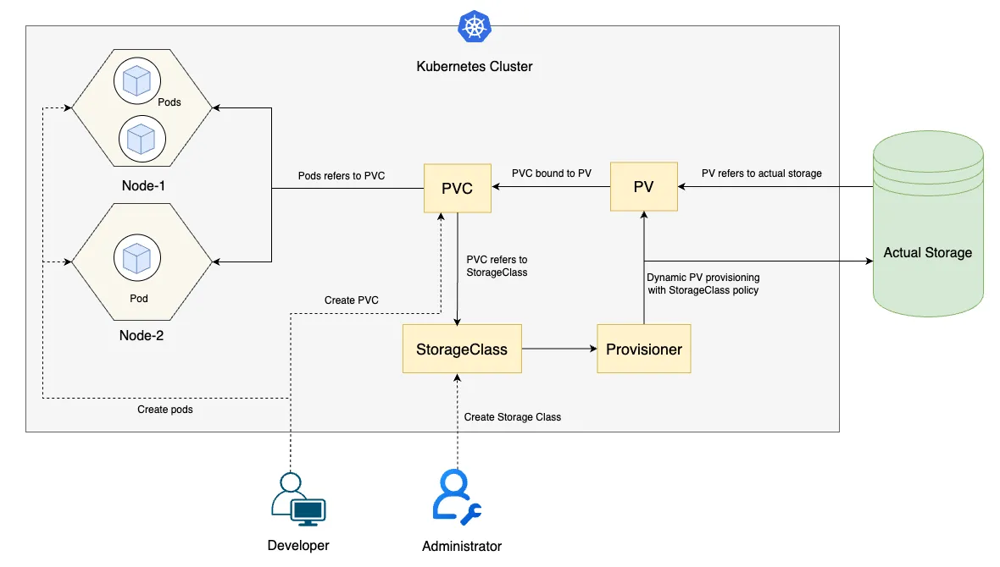

# Understanding Persistent Volumes in Kubernetes: Part 2 - Dynamic Provisioning

> 💬 *“持而盈之，不如其已；揣而锐之，不可长保。(Hold on to fullness, and it cannot remain full forever. If you sharpen a blade to its very edge, it will not last long.)"*  
> — Laozi

Welcome back to our Kubernetes storage series! In [our first post](https://wang-engineer.github.io/blogger/posts/2025-06-29-pv-1/), we explored the basics of Persistent Volumes (PVs) and Persistent Volume Claims (PVCs), laying the groundwork for managing storage in Kubernetes. Now, let’s dive into the exciting world of **dynamic provisioning**, a game-changer that simplifies storage management and makes your Kubernetes clusters more flexible and efficient.

## Introduction: Why Dynamic Provisioning?

Imagine you’re running a growing application, say a photo-sharing platform, where users are constantly uploading images. Manually creating PVs for each new storage request would be like handcrafting every picture frame in a gallery—tedious and error-prone. This is where **dynamic provisioning** shines. Instead of pre-creating PVs, dynamic provisioning lets Kubernetes automatically create PVs when a PVC is requested, based on predefined rules called **StorageClasses**.

### Benefits of Dynamic Provisioning
- **Automation**: No need to manually create PVs. Kubernetes handles it, saving you time and reducing errors.
- **Scalability**: Perfect for dynamic workloads where storage needs grow or shrink unpredictably.
- **Flexibility**: StorageClasses allow you to define different storage types (e.g., SSD, HDD) or policies (e.g., delete or retain data) to suit various use cases.
- **Efficiency**: Resources are allocated only when needed, optimizing cluster resource usage.

For example, in our photo-sharing app, dynamic provisioning ensures that every new user gets storage automatically without you provisioning a PV for each upload. It’s like having an assistant who sets up storage on demand, tailored to your app’s needs.

## Example PVC: A Quick Look

Let’s start with a sample PVC that uses dynamic provisioning. Since we covered PVC basics in the first post, we’ll focus on the key components, especially the **StorageClass** reference.

```yaml
apiVersion: v1
kind: PersistentVolumeClaim
metadata:
  name: photo-storage-pvc
spec:
  accessModes:
    - ReadWriteOnce
  resources:
    requests:
      storage: 5Gi
  storageClassName: fast-ssd
```

### Key Components
- **accessModes**: Defines how the volume can be accessed (e.g., `ReadWriteOnce` for single-node access).
- **resources.requests.storage**: Specifies the desired storage size (e.g., 5Gi).
- **storageClassName**: This is the critical part. Here, `fast-ssd` refers to a StorageClass that dictates how the PV is created. Without this, Kubernetes won’t know which storage backend or policy to use. If omitted, it might fall back to a default StorageClass (if configured) or fail if no default exists.

The `storageClassName` links the PVC to a StorageClass, which acts like a blueprint for provisioning PVs. Let’s explore StorageClasses next.

## Understanding StorageClasses

A **StorageClass** is a Kubernetes resource that defines the type of storage and its behavior. Think of it as a template that tells Kubernetes, “When someone asks for storage, give them *this* kind with *these* rules.” StorageClasses are generally predefined by the cluster administrator to provide standardized and consistent storage options.

Here’s an example StorageClass:

```yaml
apiVersion: storage.k8s.io/v1
kind: StorageClass
metadata:
  name: fast-ssd
provisioner: kubernetes.io/aws-ebs
parameters:
  type: gp3
  fsType: ext4
reclaimPolicy: Delete
volumeBindingMode: WaitForFirstConsumer
```

### Key Fields
- **provisioner**: Specifies the storage provider (e.g., `kubernetes.io/aws-ebs` for AWS EBS volumes). Each cloud provider or storage system has its own provisioner.
- **parameters**: Provider-specific settings, like the disk type (`gp3` for AWS) or filesystem (`ext4`).
- **reclaimPolicy**: Defines what happens to the PV and underlying storage when the PV is released. When a PV is attached to an existing PVC, the status is "bound". Otherwise, if the bounding PVC is deleted, the PV status converts to "released". Options for reclaim Policy are:
  - **Delete**: The PV and its backing storage (e.g., EBS volume) are deleted.
  - **Retain**: The PV and its backing storage still exist. To reclaim the volume and storage, the administrator has to manually delete them.
- **volumeBindingMode**: Controls when the PV is provisioned. There are two main options:
  - **Immediate**: The PV is provisioned as soon as the PVC is created, regardless of whether a pod is ready to use it. This is faster but may result in a PV being created in a suboptimal location (e.g., a different availability zone than the pod).
  - **WaitForFirstConsumer**: Delays provisioning until a pod using the PVC is scheduled, ensuring the PV is created in a location compatible with the pod’s node (e.g., the same availability zone). This is ideal for cloud environments where storage location matters.

Here’s another example for a different use case:

```yaml
apiVersion: storage.k8s.io/v1
kind: StorageClass
metadata:
  name: archival-hdd
provisioner: kubernetes.io/gce-pd
parameters:
  type: pd-standard
reclaimPolicy: Retain
volumeBindingMode: Immediate
```

This `archival-hdd` StorageClass uses Google Cloud’s standard persistent disks and provisions PVs immediately upon PVC creation, suitable for cases where pod scheduling is less sensitive to storage location.

## How PVs and Storage Are Created

When a PVC referencing a StorageClass is created, Kubernetes triggers the following process:
1. The PVC specifies a `storageClassName` (e.g., `fast-ssd`).
2. The associated **provisioner** (e.g., `kubernetes.io/aws-ebs`) is invoked.
3. The provisioner creates the underlying storage (e.g., an EBS volume in AWS) based on the StorageClass `parameters`.
4. Kubernetes creates a PV to represent this storage, binding it to the PVC.
5. The PV is ready for use by pods.

For example, applying the `photo-storage-pvc` above with the `fast-ssd` StorageClass might result in a PV like this:

```yaml
apiVersion: v1
kind: PersistentVolume
metadata:
  name: pv-12345
spec:
  capacity:
    storage: 5Gi
  accessModes:
    - ReadWriteOnce
  persistentVolumeReclaimPolicy: Delete
  storageClassName: fast-ssd
  awsElasticBlockStore:
    volumeID: vol-xyz
    fsType: ext4
```

This PV is automatically created and bound to the PVC, with the `awsElasticBlockStore` details filled in by the provisioner.



## Creating and Inspecting PVCs, PVs, and StorageClasses

To create a PVC and verify dynamic provisioning, you can use the following command to apply the PVC defined earlier:

```bash
kubectl apply -f photo-storage-pvc.yaml
```

This command creates the `photo-storage-pvc` PVC, triggering dynamic provisioning if the `fast-ssd` StorageClass is available.

To inspect and troubleshoot, use these `kubectl` commands:

```bash
# List all StorageClasses
kubectl get storageclass

# View details of a specific StorageClass
kubectl describe storageclass fast-ssd

# List all PVCs
kubectl get pvc

# View details of a specific PVC
kubectl describe pvc photo-storage-pvc

# List all PVs
kubectl get pv

# View details of a specific PV
kubectl describe pv pv-12345
```

For example, `kubectl describe pvc photo-storage-pvc` might show the bound PV and its status, confirming that dynamic provisioning worked.

## Clarifications and Pitfalls to Avoid

Dynamic provisioning is powerful, but there are a few things to watch out for:

- **Access Mode Clarification**: The `accessModes` field in a PVC defines how the volume can be mounted. According to the [Kubernetes documentation](https://kubernetes.io/docs/concepts/storage/persistent-volumes/#access-modes):
  - **ReadWriteOnce**: The volume can be mounted as read-write by a single node, but multiple pods on that node can access it.
  - **ReadOnlyMany**: The volume can be mounted as read-only by multiple nodes.
  - **ReadWriteMany**: The volume can be mounted as read-write by multiple nodes.
  - **ReadWriteOncePod**: The volume can be mounted as read-write by only a single pod (introduced in Kubernetes 1.22, requires enabling the `ReadWriteOncePod` feature gate). Use this for workloads where only one pod should access the volume at a time, ensuring stricter isolation.
  Be mindful when choosing `ReadWriteOnce` versus `ReadWriteOncePod`. For example, `ReadWriteOnce` is suitable for a database pod on a single node, but if you need to restrict access to a single pod (e.g., for a specific application instance), use `ReadWriteOncePod`.
- **Reclaim Policy Risks**: If the StorageClass uses `Delete`, deleting a PVC will also delete the underlying storage, potentially causing data loss. Use `Retain` for critical data, but be aware that retained storage requires manual cleanup to avoid resource waste.
- **Default StorageClass**: If no `storageClassName` is specified in a PVC, Kubernetes uses the cluster’s default StorageClass (if set). Check with `kubectl get storageclass` to see if any are marked `(default)`. Misusing the default can lead to unexpected storage types.
- **Resource Limits**: Some cloud providers impose limits on storage resources (e.g., AWS EBS volume limits). Monitor usage to avoid hitting quotas.
- **Cost Management**: Dynamic provisioning can lead to over-provisioning if PVCs are created carelessly. Regularly review unused PVs and PVCs to control costs.
- **Provisioner Dependencies**: Ensure the provisioner (e.g., AWS EBS CSI driver) is installed and configured correctly, or provisioning will fail.

To avoid resource waste:
- Use `kubectl delete pvc <name>` carefully, especially with `Delete` reclaim policies.
- For `Retain` policies, periodically check for orphaned storage (e.g., unattached EBS volumes in AWS) and delete them manually via the cloud provider’s console or CLI.

## Summary and Further Reading

Dynamic provisioning with StorageClasses makes Kubernetes storage management a breeze, automating PV creation and tailoring storage to your needs. By defining StorageClasses with appropriate reclaim policies, volume binding modes, and access modes like `ReadWriteOnce` or `ReadWriteOncePod`, you can balance automation, data safety, and cost efficiency. Just keep an eye on policies, access modes, and resource usage to avoid surprises.

For more details, check out the [official Kubernetes documentation on Dynamic Provisioning](https://kubernetes.io/docs/concepts/storage/dynamic-provisioning/). Happy provisioning, and let Kubernetes do the heavy lifting for your storage needs!