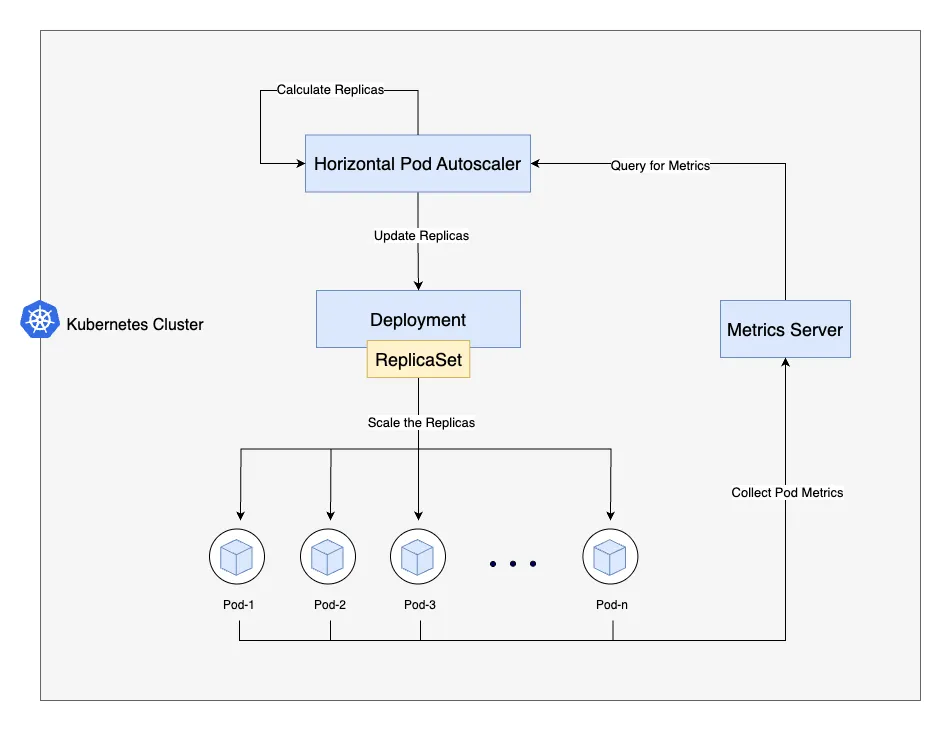

# Scaling Smart with Kubernetes Horizontal Pod Autoscaling (HPA)

> 💬 *“人法地，地法天，天法道，道法自然。(Man follows the Earth, the Earth follows Heaven, Heaven follows the Dao, and the Dao follows Nature.)"*  
> — Laozi

## Introduction: Taking Scaling to the Next Level

In our [previous post](https://wangmle.dev/blogger/posts/2025-06-07-deployment-yaml/), we explored how to craft a robust `Deployment` in Kubernetes to ensure your application runs smoothly with the desired number of pods. But what happens when traffic spikes unexpectedly, or usage drops during off-peak hours? Manually adjusting replicas is like trying to keep up with a rollercoaster—doable, but exhausting. Enter **Horizontal Pod Autoscaling (HPA)**, Kubernetes' answer to dynamic scaling.

HPA automatically adjusts the number of pods in a deployment based on real-time metrics like CPU or memory usage. This means your application can scale up to handle surges in demand and scale down to save resources when things are quiet. Why use HPA?
- **Efficiency**: No more overprovisioning pods "just in case"—HPA ensures you use only what you need.
- **Resilience**: It keeps your app responsive during traffic spikes, preventing slowdowns or crashes.
- **Cost savings**: By scaling down during low demand, you optimize resource usage, especially in cloud environments.
- **Automation**: Set it and forget it—HPA handles scaling while you focus on building features.

Imagine an e-commerce app during a Black Friday sale. Without HPA, you might overprovision pods and waste resources or underprovision and frustrate customers with slow load times. With HPA, Kubernetes dynamically adjusts pod counts to match demand, keeping your app responsive and your costs in check. Let’s dive into how to set this up!

## Example Deployment: Our Scaling Target

To illustrate HPA, let’s start with a sample `Deployment` for a web application. This will be the target for our autoscaling setup.

```yaml
apiVersion: apps/v1
kind: Deployment
metadata:
  name: web-app
  namespace: default
spec:
  replicas: 2
  selector:
    matchLabels:
      app: web-app
  template:
    metadata:
      labels:
        app: web-app
    spec:
      containers:
      - name: web-container
        image: nginx:1.14.2
        ports:
        - containerPort: 80
        resources:
          requests:
            cpu: "500m"
            memory: "512Mi"
          limits:
            cpu: "1000m"
            memory: "1024Mi"
```

This `Deployment` runs an Nginx web server with 2 replicas by default. Each pod requests 0.5 CPU and 512Mi of memory, with limits of 1 CPU and 1GiB. This setup ensures a baseline performance, but we’ll use HPA to dynamically adjust the number of replicas based on load.

## Example HPA Configuration

Now, let’s create an HPA to manage the pods in the `web-app` deployment. This HPA will scale based on CPU utilization and includes custom scaling behavior for fine-tuned control.

```yaml
apiVersion: autoscaling/v2
kind: HorizontalPodAutoscaler
metadata:
  name: web-app-hpa
  namespace: default
spec:
  scaleTargetRef:
    apiVersion: apps/v1
    kind: Deployment
    name: web-app
  minReplicas: 2
  maxReplicas: 10
  metrics:
  - type: Resource
    resource:
      name: cpu
      target:
        type: Utilization
        averageUtilization: 70
  behavior:
    scaleUp:
      stabilizationWindowSeconds: 60
      policies:
      - type: Percent
        value: 100
        periodSeconds: 15
    scaleDown:
      stabilizationWindowSeconds: 300
      policies:
      - type: Percent
        value: 10
        periodSeconds: 60
```

This HPA monitors the CPU usage of the `web-app` deployment, scales between 2 and 10 pods, and targets 70% CPU utilization. The `behavior` section customizes how quickly and aggressively it scales up and down.

## Breaking Down the HPA Configuration

Let’s dissect the key components of the HPA spec, including the `behavior` section, to understand what each part does and explore common values:

- **apiVersion: autoscaling/v2**: Specifies the API version for HPA. Use `v2` for advanced metrics and behavior support. Older `v1` is simpler but lacks these features.
- **kind: HorizontalPodAutoscaler**: Declares this as an HPA resource.
- **metadata**: Includes the `name` (e.g., `web-app-hpa`) and `namespace` (e.g., `default`). Ensure the namespace matches the target deployment.
- **spec.scaleTargetRef**: Links the HPA to the target resource (our `web-app` deployment). Common values:
  - `apiVersion`: Typically `apps/v1` for deployments.
  - `kind`: Usually `Deployment`, but can also be `ReplicaSet` or `StatefulSet`.
  - `name`: The exact name of the target resource (e.g., `web-app`).
- **spec.minReplicas**: The minimum number of pods (e.g., 2). Common values: 1–5, depending on your app’s baseline needs.
- **spec.maxReplicas**: The maximum number of pods (e.g., 10). Common values: 5–50, based on cluster capacity and cost constraints.
- **spec.metrics**: Defines the scaling criteria. Here, we use CPU utilization. Common options:
  - `type: Resource`: Scales based on resource metrics like CPU or memory.
  - `resource.name`: `cpu` or `memory`. CPU is more common due to its predictability.
  - `target.type: Utilization`: Measures average utilization as a percentage of requested resources.
  - `target.averageUtilization`: The target percentage (e.g., 70%). Common values: 60–80% for CPU, 70–90% for memory.
  - Other metric types: `Pods` (custom metrics per pod), `Object` (external metrics like queue length), or `External` (e.g., cloud provider metrics).
- **spec.behavior**: Customizes scaling behavior for scale-up and scale-down events:
  - **scaleUp.stabilizationWindowSeconds**: Time (in seconds) to consider past scaling decisions to prevent rapid scale-ups (e.g., 60). Common values: 0–300. A shorter window (like 60) allows faster scaling but risks thrashing.
  - **scaleUp.policies**: Defines how many pods to add during scale-up:
    - `type: Percent`: Scales by a percentage of current replicas (e.g., 100 means double the replicas).
    - `value`: The percentage or number of pods to add (e.g., 100%). Common values: 50–200% for aggressive scaling.
    - `periodSeconds`: Time between scaling actions (e.g., 15). Common values: 15–60 for responsiveness.
  - **scaleDown.stabilizationWindowSeconds**: Time to stabilize scale-down decisions (e.g., 300). Common values: 300–600 to avoid premature scaling down.
  - **scaleDown.policies**: Defines how many pods to remove:
    - `type: Percent`: Scales down by a percentage (e.g., 10%).
    - `value`: The percentage to remove (e.g., 10%). Common values: 5–20% for cautious scaling.
    - `periodSeconds`: Time between scale-down actions (e.g., 60). Common values: 30–300 for stability.

This configuration ensures controlled scaling, with aggressive scale-up (doubling replicas every 15 seconds if needed) and cautious scale-down (removing 10% of replicas every 60 seconds).



## How HPA Works: Scaling Up and Down

Let’s see how our HPA operates with the `web-app` deployment, factoring in the custom `behavior`. The HPA controller checks CPU utilization every 15 seconds (configurable via `--horizontal-pod-autoscaler-sync-period`).

### Scaling Up
Suppose traffic spikes, and CPU utilization hits 80%, above our 70% target. The HPA calculates desired replicas:
```
desiredReplicas = ceil[currentReplicas * (currentMetricValue / desiredMetricValue)]
```
With 2 replicas:
```
desiredReplicas = ceil[2 * (80 / 70)] = ceil[2 * 1.14] = 3
```
The `behavior.scaleUp` policy allows adding 100% of current replicas (2 pods) every 15 seconds, so HPA scales to 4 pods (2 + 100%) if needed. The `stabilizationWindowSeconds: 60` ensures it only scales up if the need persists for 60 seconds, preventing overreaction to brief spikes.

### Scaling Down
When traffic drops to 30% CPU utilization with 4 replicas:
```
desiredReplicas = ceil[4 * (30 / 70)] = ceil[4 * 0.43] = 2
```
The `behavior.scaleDown` policy removes 10% of replicas (0.4 pods, rounded to 1) every 60 seconds, so HPA reduces to 3 pods, then 2 after another 60 seconds. The `stabilizationWindowSeconds: 300` ensures it waits 5 minutes before scaling down, avoiding premature reductions.

The HPA relies on the Kubernetes Metrics Server for pod metrics. Ensure it’s installed (`kubectl top pods` should work).

## Commands to Deploy, Inspect, and Debug HPA

Here are practical commands to work with HPA, PersistentVolumeClaims (PVCs), and PersistentVolumes (PVs):

### Deploying the HPA
1. Save the deployment YAML as `web-app-deployment.yaml` and apply:
   ```bash
   kubectl apply -f web-app-deployment.yaml
   ```
2. Save the HPA YAML as `web-app-hpa.yaml` and apply:
   ```bash
   kubectl apply -f web-app-hpa.yaml
   ```

### Inspecting HPA
- Check HPA status:
  ```bash
  kubectl get hpa web-app-hpa
  ```
  Shows current replicas, target, and actual utilization.
- View detailed info:
  ```bash
  kubectl describe hpa web-app-hpa
  ```
  Includes events, metrics, and scaling decisions.

### Debugging HPA
- Verify Metrics Server:
  ```bash
  kubectl get pods -n kube-system | grep metrics-server
  ```
- Check pod resource usage:
  ```bash
  kubectl top pods
  ```
- Inspect HPA events:
  ```bash
  kubectl get events | grep web-app-hpa
  ```

If HPA isn’t scaling, ensure the Metrics Server is running and resource requests are set.

## Clarifications and Pitfalls

HPA is powerful but has nuances:

1. **CPU Utilization is Based on Requests, Not Limits**: In our example,each pod requests 0.5 CPU and limits 1 CPU. HPA targets 70% of the *request* (0.35 CPU), not the limit. At 0.35 CPU usage, HPA scales up, using only 35% of the limit, potentially wasting resources. To avoid this, make sure your requests and limits are aligned, or adjust your scaling logic to use custom metrics that better reflect actual resource usage.
2. **Metrics Server Dependency**: As mentioned before, HPA relies on the Kubernetes Metrics Server to collect resource usage data. Ensure it is installed and running in your cluster. You can usually find installation instructions in the official Kubernetes documentation or your cloud provider's guides.
3. **Custom Behavior Tuning**: Our `scaleUp` policy (100% every 15 seconds) is aggressive, ideal for spiky workloads. The `scaleDown` policy (10% every 60 seconds) is cautious, preventing thrashing. Adjust `stabilizationWindowSeconds` for your workload—shorter for fast-changing apps, longer for stability.
4. **Resource Requests Are Critical**: Unset requests break HPA. Always set `resources.requests`.
5. **Max Replicas Limit**: Ensure `maxReplicas` fits cluster capacity to avoid evictions.
6. **Custom Metrics**: For advanced scaling (e.g., HTTP requests), use Prometheus with the Custom Metrics API.

## Summary and Further Reading

Horizontal Pod Autoscaling makes your Kubernetes apps adaptable. Our HPA, with custom scaling behavior, balances responsiveness (fast scale-up) and stability (cautious scale-down) for the `web-app` deployment. Key takeaways: set resource requests, tune scaling policies, and monitor metrics. Avoid pitfalls like misaligned requests and limits.

For more, check the [official Kubernetes HPA documentation](https://kubernetes.io/docs/tasks/run-application/horizontal-pod-autoscale/). Ready to scale smart with HPA!